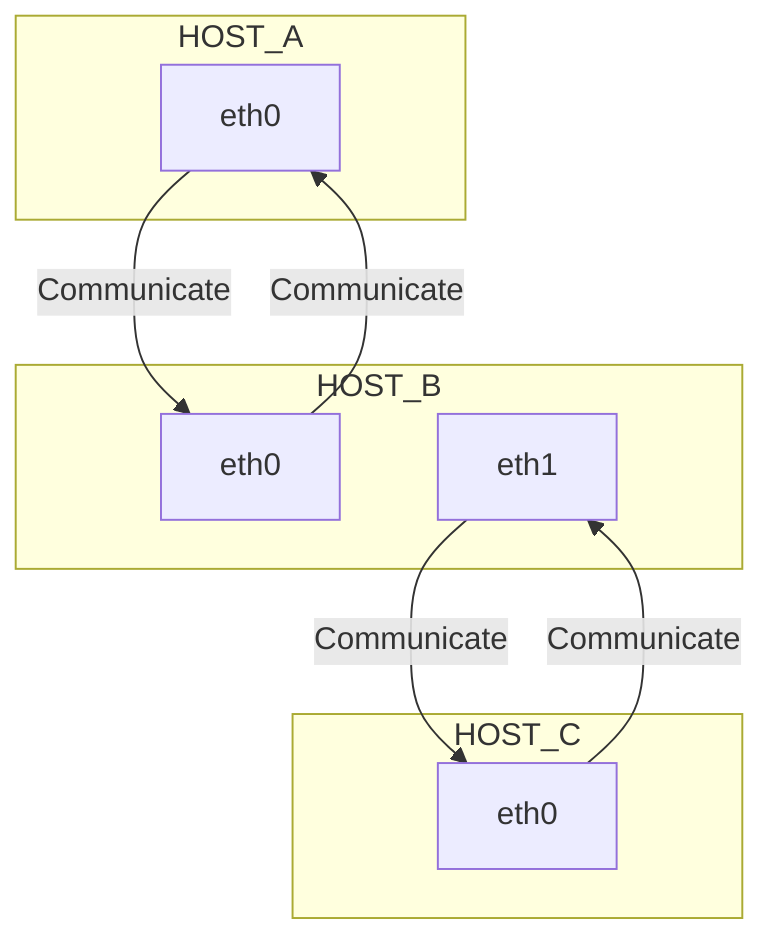

# Setup network-bridge between two interfaces and enable routing

You want to connect two hosts **_A and C_** by bridging over a third host **_B_**?

Here is your solution:

## Setup bridge on HOST_B

## Add route to bridge on HOST C
